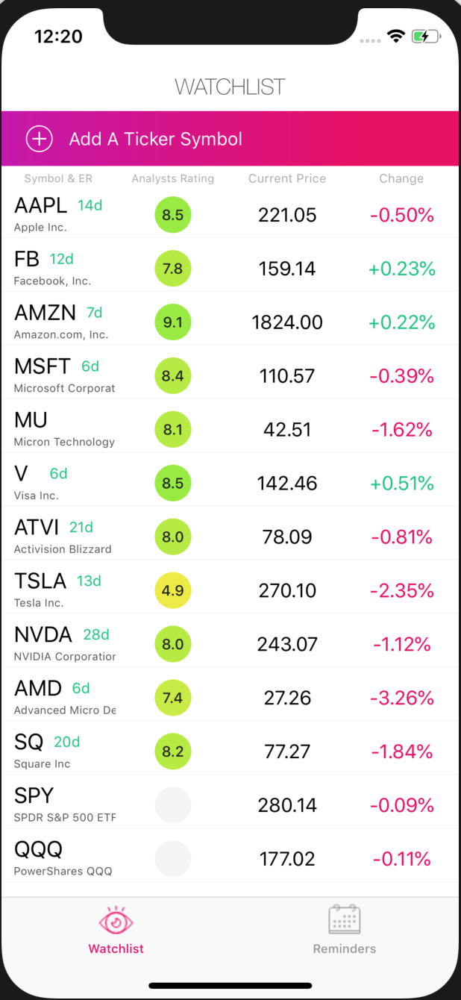

# easy-equity

--in development--

### Features of the project

1. Create portfolio/watchlist
   + Multiple lists?
2. See stock charts and other important data
   + Earnings date
   + News
   + Target prices and analyst info from tipranks
   + Financial information and fundamental analysis
3. Get daily recommended actions about your portfolio based on a variety of indicators
   + Trends: long/medium/shorterm -> following and breaking trends
   + Supports and resistances (failing to break through previous ATH or breaking above it)
   + Gap-filling
   + 20/50/100/200-day EMA proximity
   + Earnings date proximity (mostly for selling covered calls)
   + Dividend payout
   + RSI/MACD/BB and deviation from normal trading ranges
   + 3-day rule reminder after large price movements
   + The Thursday rule
   + Special events such as increased volatility at end of a month/quarter, January effect, end of year sell-off of     underperforming stocks
   + Collars with optimal risk/reward ratios using analyst price targets: user can add a trade and be notified if/when the trade should be closed
         + trade finding involves considering the smallest amount of money that could be used to execute the trade (cost of 100 shares - premium of sell 1 call + cost of buy 1 put) and that amount can be scaled up (x2, x3, x4, etc) as much as needed
4. Consider adding an information page about proper investing mindset
   + preservation of wealth above all
   + importance of big early contributions and saving maximum amount of money
   + optimal risk/reward setups (1:4 ratios)
   + simulator??

### Design
 &nbsp;&nbsp;&nbsp;&nbsp;&nbsp;
