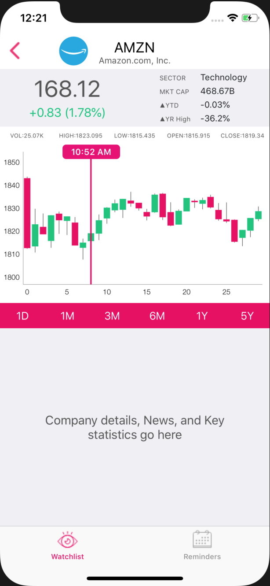

# easy-equity

--in progress--

### Features of the project

1. Create portfolio/watchlist
2. See stock charts and other important data
   + Earnings date
   + News
   + Target prices and analyst info from tipranks
   + Financial information and fundamental analysis
3. Get daily recommended actions about your portfolio based on a variety of indicators
   + Trends: long/medium/shorterm -> following and breaking trends
   + Supports and resistances (failing to break through previous ATH or breaking above it)
   + Gap-filling
   + 20/50/100/200-day EMA proximity
   + Earnings date proximity (mostly for selling covered calls)
   + Dividend payout
   + RSI/MACD/BB and deviation from normal trading ranges
   + 3-day rule reminder after large price movements
   + The Thursday rule
   + Special events such as increased volatility at end of a month/quarter, January effect, end of year sell-off of     underperforming stocks
   + Recommended long term collar strategy for everything on your watchlist
 4. Consider adding an information page about proper investing mindset
   + preservation of wealth above all
   + optimal risk/reward setups (1:4 ratios)

### Design
 &nbsp;&nbsp;&nbsp;&nbsp;&nbsp;
